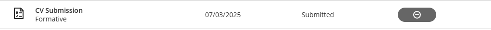

# Digital Portfolio
## Christian Smith

### Career Counselling

**Reflection**

* **S** : I completed the Career Counselling course to explore career paths aligned with my strengths and aspirations.
* **T** : My objective was to identify careers that best matched my values, interests, and abilities.
* **A** : I engaged in self-assessment activities and reflective exercises to analyse how my personal profile aligns with potential careers.
* **R** : I developed a clearer understanding of my career direction and created a focused plan for my future.
 
### Skills and Interests

**Reflection**
* **S** : I completed the Skills and Interests course to better understand my strengths and what motivates me.
* **T** : The goal was to identify skills and interests that align with meaningful career opportunities.
* **A** : I worked through quizzes and reflective tasks that helped me recognise my strongest abilities and areas for growth.
* **R** : I gained valuable insights into how my skills and passions relate to career paths that suit me.

### Personality Assessment

**Reflection**
* **S** : I completed the Personality Assessment course to understand how my personality impacts my career decisions.
* **T** : The task was to assess my personality traits and determine how they influence my fit in different work environments.
* **A** : I completed personality tests and reflected on the results to understand how different roles and teams align with my style.
* **R** : I discovered how my personality influences collaboration, decision-making, and career preferences.

### Create A CV

**Reflection**
* **S** : I completed the Create a CV course to learn how to professionally present my qualifications and experiences.
* **T** : My goal was to design a clear and effective CV tailored to potential employers.
* **A** : I used structured templates, followed professional writing guidelines, and applied feedback to refine my CV.
* **R** : I produced a strong, polished CV that accurately reflects my skills and achievements.

### CV Submission

[View my CV](CV_Christian_Smith.pdf)

**Reflection**
* **S** : I completed the CV Submission course to finalise and submit a professional CV.
* **T** : The task was to enhance the quality of my CV and ensure it leaves a positive impression on employers.
* **A** : I evaluated different templates, applied feedback, and selected the best format to showcase my experience.
* **R** : I have a completed, high-quality CV that I feel confident submitting to job opportunities.

