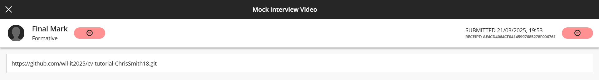
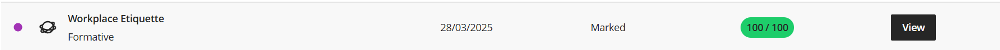

# Digital Portfolio
## Christian Smith

### 1. Career Counselling

**Reflection**

* **S** : I completed the Career Counselling course to explore career paths aligned with my strengths and aspirations.
* **T** : My objective was to identify careers that best matched my values, interests, and abilities.
* **A** : I engaged in self-assessment activities and reflective exercises to analyse how my personal profile aligns with potential careers.
* **R** : I developed a clearer understanding of my career direction and created a focused plan for my future.
 
### 2. Skills and Interests

**Reflection**
* **S** : I completed the Skills and Interests course to better understand my strengths and what motivates me.
* **T** : The goal was to identify skills and interests that align with meaningful career opportunities.
* **A** : I worked through quizzes and reflective tasks that helped me recognise my strongest abilities and areas for growth.
* **R** : I gained valuable insights into how my skills and passions relate to career paths that suit me.

### 3. Personality Assessment

**Reflection**
* **S** : I completed the Personality Assessment course to understand how my personality impacts my career decisions.
* **T** : The task was to assess my personality traits and determine how they influence my fit in different work environments.
* **A** : I completed personality tests and reflected on the results to understand how different roles and teams align with my style.
* **R** : I discovered how my personality influences collaboration, decision-making, and career preferences.

### 4. Create A CV

**Reflection**
* **S** : I completed the Create a CV course to learn how to professionally present my qualifications and experiences.
* **T** : My goal was to design a clear and effective CV tailored to potential employers.
* **A** : I used structured templates, followed professional writing guidelines, and applied feedback to refine my CV.
* **R** : I produced a strong, polished CV that accurately reflects my skills and achievements.

### 5. CV Submission

[View my CV](CV_Christian_Smith.pdf)

**Reflection**
* **S** : I completed the CV Submission course to finalise and submit a professional CV.
* **T** : The task was to enhance the quality of my CV and ensure it leaves a positive impression on employers.
* **A** : I evaluated different templates, applied feedback, and selected the best format to showcase my experience.
* **R** : I have a completed, high-quality CV that I feel confident submitting to job opportunities.

### 6. Business Communication

**Reflection**
* **S** : I completed the Business Communication course to improve my ability to communicate effectively in a professional setting.  
* **T** : The goal was to enhance my written and verbal communication skills for workplace interactions.  
* **A** : I learned key techniques for writing professional emails, conducting meetings, and presenting ideas clearly.  
* **R** : I developed stronger communication skills that will help me convey ideas confidently in professional environments.

### 7. Interview Skills

**Reflection**
* **S** : I completed the Interview Skills course to learn effective strategies for performing well in job interviews.  
* **T** : My goal was to gain confidence and improve my ability to communicate my strengths during interviews.  
* **A** : I practiced common interview questions, refined my answers, and learned how to present myself professionally.  
* **R** : I developed stronger interview techniques and now feel more prepared to make a positive impression on employers.

### 8. Mock Interview

**Reflection**
* **S** : I completed the Mock Interview course to apply and practice the interview techniques I learned.  
* **T** : My goal was to simulate real interview conditions and receive constructive feedback on my performance.  
* **A** : I participated in a mock interview session, answered common questions, and reflected on areas for improvement.  
* **R** : I gained valuable experience, increased my confidence, and learned how to refine my responses for future interviews.

### 9. Professional Networking

**Reflection**
* **S** : I completed the Professional Networking course to learn how to build and maintain valuable career connections.  
* **T** : My goal was to understand effective strategies for professional networking, both online and in person.  
* **A** : I explored different networking platforms, practiced professional communication, and identified key contacts in my field.  
* **R** : I gained confidence in engaging with professionals and developed strategies to grow and sustain a strong career network.

### 10. Workplace Etiquette

**Reflection**
* **S** : I completed the Workplace Etiquette course to understand the standards of professionalism in different work environments.  
* **T** : My goal was to learn how to conduct myself appropriately and respectfully in the workplace.  
* **A** : I studied various workplace scenarios, communication styles, and professional behaviour expectations.  
* **R** : I developed a strong understanding of workplace conduct, which will help me build positive relationships and maintain professionalism in any role.

